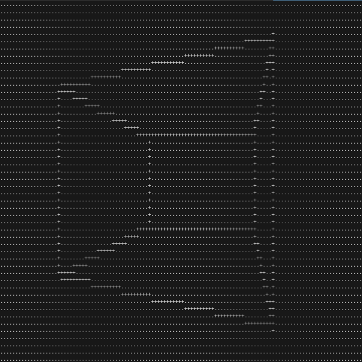
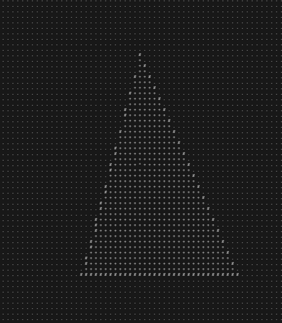

# Graphlib

Short and simple static/shared library to draw shapes

## Ready to start

```console
$ make header
$ ./animation 
$ ./raytracing 
$ ./triangle 
$ ./3DSquare
```

Here is 3 ways to compile a same program:

> - make header will compile only the programs, everything is in the header file libgraph.h
> - make obj will compile with libgraph object file and use the header file libgraph.h
> - make static will create a static librairy of graph and compile all the other programs with libgraph.a
> - make dynamic will create a dynamic librairy of graph and compile all the other programs with libgraph.so

All programs are exemples of use of the library.

## Exemples:

_Ray tracing_

[](/picture)

_Square in 3 Dimension_

[](/picture)

_All triangles_

[](/picture)
